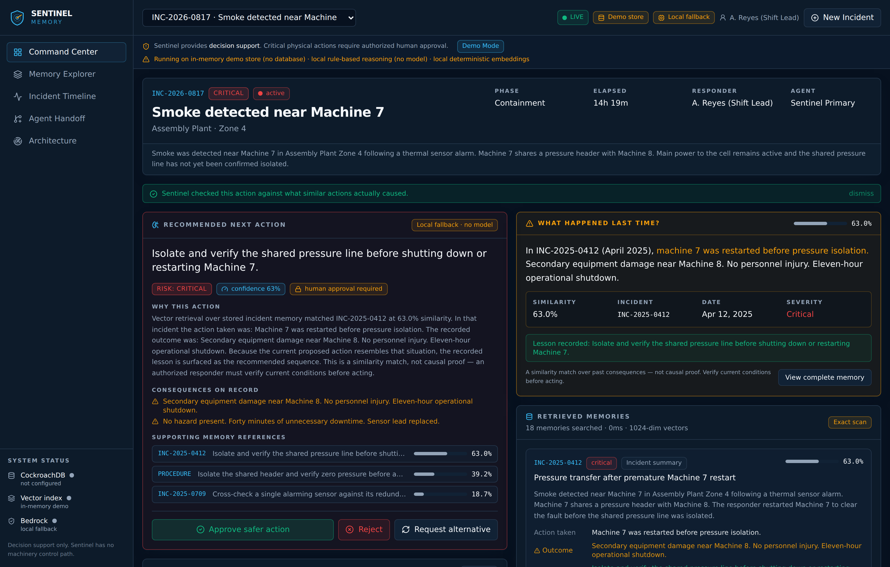
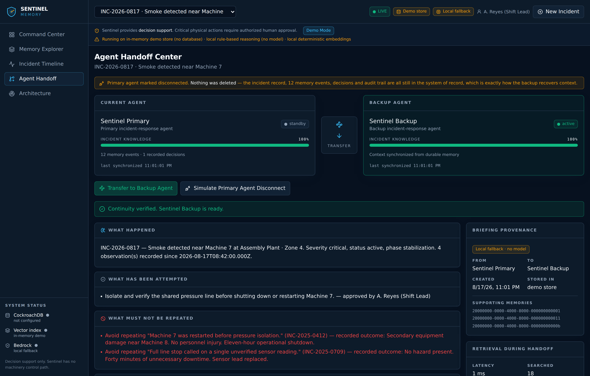
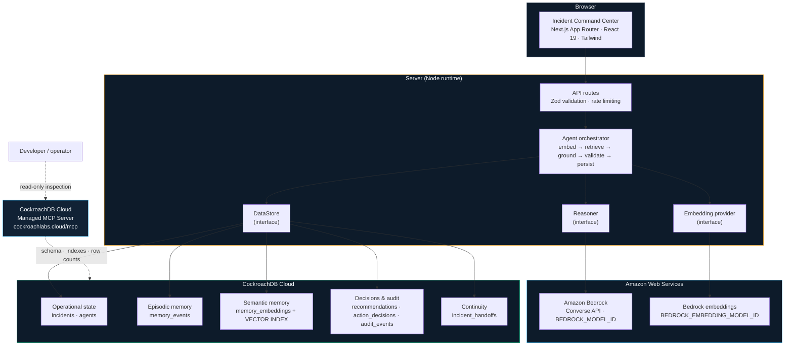

# Sentinel Memory

**An incident-response agent that remembers consequences.**

> Normal agents remember conversations. Sentinel remembers consequences.

Built for the **CockroachDB × AWS "Build with Agentic Memory" Hackathon**.

---

## Table of contents

1. [The problem](#the-problem)
2. [The solution](#the-solution)
3. [Why agentic memory matters](#why-agentic-memory-matters)
4. [Key features](#key-features)
5. [Screenshots](#screenshots)
6. [Architecture](#architecture)
7. [How CockroachDB is used](#how-cockroachdb-is-used)
8. [Distributed Vector Indexing](#distributed-vector-indexing)
9. [Managed MCP Server](#managed-mcp-server)
10. [CockroachDB Agent Skills](#cockroachdb-agent-skills)
11. [Amazon Bedrock](#amazon-bedrock)
12. [Data model](#data-model)
13. [Transactional safety design](#transactional-safety-design)
14. [Local setup](#local-setup)
15. [Environment variables](#environment-variables)
16. [Database migrations](#database-migrations)
17. [Seeding](#seeding)
18. [Development commands](#development-commands)
19. [Testing](#testing)
20. [Deployment](#deployment)
21. [Demo script](#demo-script)
22. [Demo mode and honest fallbacks](#demo-mode-and-honest-fallbacks)
23. [Security and safety limitations](#security-and-safety-limitations)
24. [Production hardening roadmap](#production-hardening-roadmap)
25. [License](#license)

---

## The problem

During an industrial emergency, the people change faster than the situation does.
Shifts rotate. Responders hand over. Agent processes restart, get redeployed, or
lose their context window. Every one of those transitions drops something.

What gets dropped is rarely the incident description — that is written down. What
gets dropped is **the consequence of what was already tried**: the action someone
took an hour ago, and the damage it caused. The next responder, arriving without
that, reaches for the same obvious action again.

That is not a hypothetical failure mode. It is the shape of a large fraction of
industrial repeat incidents: a reasonable action, taken in the wrong order,
because nobody in the room remembered what happened the last time.

An AI agent built on a context window has exactly the same failure mode, and
recreates it at machine speed.

## The solution

Sentinel Memory is an incident-response command center whose memory is a
database, not a context window.

Every observation, retrieval, recommendation, human decision, state change and
handoff is written to CockroachDB the moment it happens. Historical incidents are
stored not as narratives but as **action → outcome → lesson** triples with vector
embeddings, so when a new situation resembles an old one, Sentinel does not
retrieve a similar *story* — it retrieves what a similar *action actually caused*.

The demonstration, end to end:

1. A new incident reports smoke near Machine 7.
2. A responder considers shutting down and restarting Machine 7.
3. Sentinel embeds that proposal and searches CockroachDB's vector index.
4. It retrieves `INC-2025-0412`: the same action, taken before the shared
   pressure line was isolated, transferred pressure to Machine 8, damaged a
   secondary valve, and extended the shutdown by eleven hours.
5. Sentinel surfaces the consequence and recommends the safer sequence — isolate
   and verify the shared pressure line *first*.
6. The responder approves the safer action.
7. The approval, the recommendation status, the incident state and the audit
   event commit in **one transaction**.
8. The primary agent disconnects.
9. The backup agent reconstructs everything from CockroachDB — what happened,
   what was attempted, what must not be repeated, what is still unresolved —
   and is immediately useful.

Nothing in step 9 comes from a conversation transcript. It all comes out of the
database.

## Why agentic memory matters

There are two kinds of memory an incident agent needs, and they are not the same
thing:

**Episodic memory — what happened during *this* incident.**
An append-only log of observations, retrievals, recommendations, decisions and
state changes, each with its actor and timestamp. This is what makes an incident
*reconstructable*: any agent, at any time, can rebuild the full history by
reading `memory_events`. It is the reason a handoff is a database query rather
than a hope that someone wrote good notes.

**Semantic memory — what past actions actually caused.**
Distilled lessons, outcomes and standing procedures, embedded as vectors. This is
what makes an incident *comparable*: "smoke near Machine 7, considering a
restart" matches a 2025 pressure-transfer incident that shares almost no
keywords with the query, because the match is on meaning.

Sentinel needs both, and it needs them in the same database. Retrieval that
returns a vector but not its incident code, severity and date is not actionable
during an emergency. Because both live in CockroachDB, one query returns the
memory *and* its full provenance — and the approval that follows can be
transactional against the same rows.

## Key features

- **Counterfactual memory card** — a prominent "What happened last time?" panel
  showing the closest precedent, its similarity score, the action that was taken,
  and the outcome it produced.
- **Visible retrieval** — similarity scores, cosine distances, query latency,
  memories searched, vector width and whether the index or an exact scan served
  the query. Retrieval is shown, not hidden behind a generated answer.
- **Grounded recommendations** — Bedrock reasons only over the incident record
  and the retrieved memories, returns strict JSON, and cites the memory IDs it
  used. Citations that were not actually retrieved are filtered out.
- **Transactional approval** — approve/reject/request-alternative, with the
  four-write atomic commit described below.
- **Live audit timeline** — reconstructed from durable memory events, filterable
  by observations, AI recommendations, human decisions, warnings, state changes
  and handoffs, with each entry labelled human-entered / system-generated /
  AI-generated.
- **Agent handoff center** — one click reconstructs incident state from durable
  memory, generates a structured continuity briefing, stores it, and moves the
  incident to the backup agent.
- **Simulated disconnect** — demonstrates recovery without deleting anything.
- **Safety guardrails** — human approval enforced for high-risk physical actions
  by a post-model safety floor, not by trusting the model to comply.
- **Honest degradation** — every fallback is labelled in the UI, in
  `/api/health`, and in the API responses. Nothing claims to be an integration it
  is not.

## Screenshots

### The moment that matters

The responder proposes restarting Machine 7. Sentinel retrieves what that exact
action caused last time and recommends the safer sequence instead.



### Backup agent, briefed entirely from durable memory



### The rest

| Screenshot | What it shows |
| --- | --- |
| [`memory-explorer.png`](docs/screenshots/memory-explorer.png) | Semantic search with similarity scores and retrieval telemetry |
| [`timeline.png`](docs/screenshots/timeline.png) | Incident timeline reconstructed from durable memory events |
| [`approval-dialog.png`](docs/screenshots/approval-dialog.png) | Approval confirmation — human authorization, not actuation |
| [`command-center-approved.png`](docs/screenshots/command-center-approved.png) | Post-approval state after the atomic commit |
| [`handoff-before.png`](docs/screenshots/handoff-before.png) | Backup agent at 0% incident context, before transfer |
| [`handoff-briefing-full.png`](docs/screenshots/handoff-briefing-full.png) | The complete continuity briefing |
| [`architecture.png`](docs/screenshots/architecture.png) | Architecture page with live integration status |
| [`mobile-command-center.png`](docs/screenshots/mobile-command-center.png) | Responsive layout at 390px |

> These were captured against a production build (`npm run build && npm start`)
> with `DEMO_MODE=true` and **no** credentials configured — which is why the
> banners read "in-memory demo store" and "local fallback". That labelling is the
> point: with `DATABASE_URL` and Bedrock set, the same screens read "CockroachDB"
> and "Bedrock" instead.

## Architecture



The `/architecture` route renders the same picture in the app, annotated with
live integration status. See also [`docs/ARCHITECTURE.md`](docs/ARCHITECTURE.md).

**Three interfaces make the system honest and testable:** `DataStore`,
`EmbeddingProvider` and `Reasoner`. Each has a real implementation and a clearly
labelled local fallback. The application depends on the interface; the UI
displays which implementation actually ran.

## How CockroachDB is used

> **CockroachDB is the system of record for active incident state, immutable
> memory events, vector-searchable historical lessons, recommendations, human
> decisions, and agent handoffs.**

It is not a login database with an AI feature bolted on. It is the memory.

| What | Where | Why it is in the database |
| --- | --- | --- |
| Live incident state | `incidents`, `agents` | Survives agent restarts and redeploys |
| Episodic memory | `memory_events` | Append-only; makes the timeline reconstructable |
| Semantic memory | `memory_embeddings` | Vector-searchable consequences and lessons |
| Agent output | `recommendations` | Every recommendation is retained with its cited memory IDs |
| Human control | `action_decisions` | Who authorized what, when, and why |
| Safety policy | `safety_rules` | Guardrails are data, and are fed into the prompt |
| Conflicts | `contradictions` | Detected conflicts are tracked, not silently resolved |
| Continuity | `incident_handoffs` | The briefing itself is durable |
| Audit | `audit_events` | Before/after state, written in the same transaction |

Access is via the standard `pg` driver with parameterized SQL throughout. There
is no ORM and no string-concatenated SQL anywhere in the codebase.

## Distributed Vector Indexing

`memory_embeddings.embedding` is a `VECTOR(n)` column, where `n` is templated
into the migration from `EMBEDDING_DIMENSIONS` so it always matches the
configured embedding model.

```sql
CREATE VECTOR INDEX IF NOT EXISTS memory_embeddings_embedding_cosine_idx
    ON memory_embeddings (embedding vector_cosine_ops);
```

Retrieval orders by cosine distance and joins straight to the incident that
produced the memory — one query, memory *and* provenance:

```sql
SELECT m.id, m.source_text, m.action_taken, m.outcome, m.lesson_learned,
       i.incident_code, i.title, i.created_at AS incident_date,
       m.embedding <=> $1::VECTOR AS distance
FROM memory_embeddings m
LEFT JOIN incidents i ON i.id = m.incident_id
WHERE m.incident_id IS DISTINCT FROM $2      -- never retrieve yourself
ORDER BY m.embedding <=> $1::VECTOR
LIMIT 12;
```

Similarity shown in the UI is `1 - distance`. Results are then **diversified**:
at most one memory per source incident on the Command Center, so the responder
sees three distinct precedents instead of four angles on the same one
(`src/lib/store/retrieval.ts`, unit-tested).

**Version requirement.** Vector indexes are version-gated:

- **v25.2** — preview; requires
  `SET CLUSTER SETTING feature.vector_index.enabled = true;`
- **v25.3+** — generally available.

`db/migrations/002_vector_index.sql` is deliberately isolated from the core
schema for this reason. `scripts/migrate.ts` attempts the cluster setting, then
the index, and prints a clear warning rather than failing the migration if the
cluster does not support it. Without the index the `<=>` operator falls back to
an exact scan — correct, fine for the seeded corpus, and not scalable.
`/api/health` reports `vectorIndexPresent`, and the UI shows **"Exact scan"**
instead of **"Vector index"**. The status is never overstated.

## Managed MCP Server

**Endpoint:** `https://cockroachlabs.cloud/mcp`
**Full documentation:** [`docs/MCP.md`](docs/MCP.md)
**Config examples:** [`mcp/`](mcp/) — Claude Code and VS Code / Cursor

The Managed MCP Server is Sentinel's **operator inspection path**, deliberately
separate from the application's runtime path. The app talks to CockroachDB over
the PostgreSQL wire protocol with write credentials; an operator inspects the
same cluster through MCP with a **read-only service account**. Nobody needs a
copy of the application's write credentials to answer "did the vector index
actually get created?".

Used during development to:

1. Validate the schema after each migration — all ten tables, the `VECTOR(n)`
   width, the foreign keys and CHECK constraints.
2. Confirm whether `002_vector_index.sql` succeeded on the running cluster
   version (`SHOW INDEXES FROM memory_embeddings`) — the same fact
   `/api/health` reports to the UI.
3. Spot-check seeded data — specifically that memories carry a non-null
   `action_taken`, `outcome` and `lesson_learned`, since a memory without a
   recorded consequence is useless to this product.
4. Verify after an approval that one decision produced exactly one
   `action_decisions` row, one `audit_events` row, the updated recommendation
   status, the updated incident phase and the matching `memory_events` — i.e.
   that the atomicity claim below holds in practice, not just in intent.

`docs/MCP.md` contains the exact queries. **No token is committed**;
`.mcp.json`, `.vscode/mcp.json` and `.cursor/mcp.json` are all git-ignored.

## CockroachDB Agent Skills

Repository: **https://github.com/cockroachlabs/cockroachdb-skills**

```bash
npx skills add cockroachlabs/cockroachdb-skills
```

The skills are organized into ten domains. These are the ones that map onto real
decisions in this codebase, and what each one changed:

| Skill domain | Decisions it guided |
| --- | --- |
| `cockroachdb-query-and-schema-design` | UUID primary keys with `gen_random_uuid()` rather than sequential integers (avoids hotspotting on a distributed cluster); composite indexes ordered to match real access patterns — `memory_events (incident_id, created_at ASC)` for the timeline, `recommendations (incident_id, status, created_at DESC)` for "the pending recommendation for this incident"; `JSONB` for genuinely open-shaped payloads (`metadata`, `summary`, `before_state`) but typed columns with CHECK constraints for everything the application branches on. |
| `cockroachdb-application-development` | Serializable isolation means the *application* owns retry. `withTransaction` retries SQLSTATE `40001` with exponential backoff and full jitter, re-executing the entire unit of work (`src/lib/db/client.ts`). `SELECT … FOR UPDATE` on the recommendation and incident rows so two responders cannot both decide the same recommendation. Parameterized SQL with no string concatenation anywhere. |
| `cockroachdb-performance-and-scaling` | Over-fetch then diversify in application code rather than issuing N queries; a bounded connection pool (`max: 8`) sized for a serverless deployment where many instances share a cluster's connection budget; `LIMIT` on every unbounded read path. |
| `cockroachdb-resilience-and-disaster-recovery` | The reason the whole product works: nothing that matters is held in process memory. An agent can die mid-incident and the replacement reconstructs from `memory_events`. Retry logic assumes transient node unavailability (`08006`, `57P01`) is normal, not exceptional. |
| `cockroachdb-security-and-governance` | Two credentials, two purposes: the app's write-capable `DATABASE_URL` and a separate read-only MCP service account. TLS enforced via `sslmode=verify-full` with `rejectUnauthorized: true`. `/api/health` reports host and port but never the DSN — asserted by `tests/health.test.ts`. |
| `cockroachdb-observability-and-diagnostics` | `/api/health` reports connectivity, latency, vector-index presence and memory counts. `application_name` is set on every connection so cluster-side query attribution works. Retrieval telemetry is surfaced in the UI instead of being logged and forgotten. |
| `cockroachdb-integrations-and-ecosystem` | Standard `pg` driver over the PostgreSQL wire protocol — no bespoke client. `serverExternalPackages: ['pg']` so the driver is not bundled into the server build. |
| `cockroachdb-onboarding-and-migrations` | Idempotent migrations (`CREATE TABLE IF NOT EXISTS`, `ON CONFLICT DO UPDATE` seeding with fixed UUIDs), and the version-gated vector index isolated into its own migration file with an explicit documented cluster-version requirement. |

> **Scope note.** These are documented design influences, traceable to specific
> lines in this repository. The skills repository was consulted for its published
> skill set and the CockroachDB guidance it points to; install it with the
> command above to review the same material.

## Amazon Bedrock

Bedrock is used for six things:

1. **Incident analysis** — assessing a new observation against retrieved memory.
2. **Risk summaries** — assigning a risk level and enumerating consequences that
   are actually on record.
3. **Recommended next actions** — the safer sequence, grounded in precedent.
4. **Agent handoff summaries** — the structured continuity briefing.
5. **Contradiction detection** — flagging statements that cannot both be true.
6. **Explaining relevance** — why a retrieved memory applies to the situation.

**Model-agnostic by construction.** All calls go through the **Converse API**,
which gives one request shape across model families. `BEDROCK_MODEL_ID` is a
plain configuration value — there is no hardcoded model ID anywhere in the
codebase. Credentials come from explicit env vars when present, otherwise from
the default AWS provider chain (IAM role, SSO profile, container credentials).

**Structured output contract.** The model must return exactly this JSON, which is
validated with Zod before a responder sees anything:

```jsonc
{
  "riskLevel": "critical | high | medium | low",
  "recommendedAction": "string",
  "explanation": "string",
  "confidence": 0.0,
  "supportingMemoryIds": ["uuid"],
  "potentialConsequences": ["string"],
  "requiresHumanApproval": true,
  "contradictions": [{ "statementA": "…", "statementB": "…", "explanation": "…" }]
}
```

A response that fails validation is **rejected** — the API returns 502 and no
recommendation is recorded. It is never shown to a responder.

**The prompt's hard rules** (`src/lib/ai/prompts.ts`, asserted in tests):

- Use only the provided incident context and retrieved memories.
- Never fabricate procedures, sensor readings, or outcomes.
- Distinguish known facts from inferences.
- Never claim an external physical action was performed — Sentinel recommends,
  a human decides and acts.
- Recommend escalation when information is insufficient.
- High-risk physical actions always require human approval.
- Cite the exact memory IDs used.
- Retrieved memories are context, **not guaranteed causal proof**.

**The post-model safety floor.** The prompt asks for these properties; the code
does not trust the model to deliver them. `enforceSafetyFloor` runs on every
response and:

- forces `requiresHumanApproval = true` on any high-risk physical action or any
  high/critical risk level, regardless of what the model returned;
- filters `supportingMemoryIds` down to IDs that were genuinely retrieved, so a
  hallucinated citation cannot reach the UI.

**Embeddings.** If `BEDROCK_EMBEDDING_MODEL_ID` is set, Bedrock produces the
vectors (Titan and Cohere request/response shapes are both handled). If it is
not, a deterministic local provider is used instead — see
[Demo mode and honest fallbacks](#demo-mode-and-honest-fallbacks). Because
`EmbeddingProvider` is an interface, swapping in any other provider requires no
architectural change.

## Data model

Ten tables. Full DDL in [`db/migrations/001_init.sql`](db/migrations/001_init.sql).

```
agents ──────────────┐
                     ├──< incidents ──┬──< memory_events ──┐
                     │                │                    │
                     │                ├──< memory_embeddings (VECTOR + vector index)
                     │                │
                     │                ├──< recommendations ──< action_decisions
                     │                ├──< contradictions
                     │                ├──< audit_events
                     └────────────────┴──< incident_handoffs

safety_rules (standalone policy)
```

| Table | Purpose | Notable columns |
| --- | --- | --- |
| `agents` | Primary/backup response agents | `status` (active/ready/standby/disconnected) |
| `incidents` | Live operational state | `incident_code` (unique), `severity`, `status`, `current_phase` |
| `memory_events` | Append-only episodic memory | `event_type`, `actor_type`, `metadata` JSONB, `immutable` |
| `memory_embeddings` | Semantic memory | `embedding VECTOR(n)`, `action_taken`, `outcome`, `lesson_learned` |
| `recommendations` | Agent output | `retrieved_memory_ids` JSONB, `confidence`, `risk_level`, `status` |
| `action_decisions` | Human control | `decision`, `decided_by`, `reason` |
| `safety_rules` | Guardrail policy | `enforcement_level`, `requires_human_approval` |
| `contradictions` | Conflict tracking | `statement_a`, `statement_b`, `resolution_status` |
| `incident_handoffs` | Continuity | `summary` JSONB, `supporting_memory_ids` JSONB |
| `audit_events` | Immutable audit trail | `before_state`, `after_state` JSONB |

**One addition to the brief's schema:** `memory_embeddings.action_taken`. The
product's core question is "what did this *action* cause?", not "what happened?",
and separating the action from the outcome is what makes the counterfactual card
possible.

CHECK constraints enforce every enum at the database level, so an invalid
severity or status cannot exist even if application validation were bypassed.

## Transactional safety design

> **The approval transaction prevents a recommendation from appearing approved
> unless the incident state and audit history are updated successfully.**

When a responder approves an action, this runs as a single CockroachDB
transaction (`CockroachStore.decideRecommendation`):

```
BEGIN
  SELECT … FROM recommendations WHERE id = $1 FOR UPDATE   -- no double-decide
  SELECT … FROM incidents       WHERE id = $2 FOR UPDATE

  1. INSERT INTO action_decisions …          -- the approval record
  2. UPDATE recommendations SET status …     -- the recommendation status
  3. UPDATE incidents SET status, phase …    -- the incident's current state
  4. INSERT INTO audit_events …              -- immutable audit, before + after
  5. INSERT INTO memory_events …             -- durable timeline entries
COMMIT
```

If any statement fails, **none** of them commit. There is no state in which the
UI shows "approved" but the audit trail is missing it, or the incident phase
disagrees with the decision that caused it.

**Serialization retry.** CockroachDB runs SERIALIZABLE by default, so
transaction retry is the application's responsibility. `withTransaction` catches
SQLSTATE `40001` (and transient connection codes) and re-executes the *entire*
unit of work with exponential backoff and full jitter, up to four attempts. This
is covered by unit tests using a fake pg client — no live cluster required:

- BEGIN/COMMIT wrapping
- rollback and rethrow on a non-retryable error, with no COMMIT issued
- retry on `40001`, eventually committing
- giving up after `maxAttempts` with nothing committed
- the client released on every attempt, including failures

**Double-decide protection.** A second decision on an already-decided
recommendation raises `ConflictError` → HTTP 409, and changes nothing.

## Local setup

Requirements: **Node.js 20+** (developed on 22) and npm.

```bash
git clone https://github.com/ParishruthiGanesh/sentinel-memory.git
cd sentinel-memory
npm install
cp .env.example .env.local
npm run dev
```

Open **http://localhost:3000**.

It runs immediately with no credentials at all — on the in-memory demo store and
local rule-based reasoning, both clearly labelled in the UI. To wire up the real
integrations:

```bash
# 1. Set DATABASE_URL in .env.local (CockroachDB Cloud → Connect)
npm run db:migrate
npm run db:seed

# 2. Set AWS_REGION + BEDROCK_MODEL_ID (+ optionally BEDROCK_EMBEDDING_MODEL_ID)
#    then restart the dev server.
```

Verify what is actually live at any time:

```bash
curl -s localhost:3000/api/health | jq
```

## Environment variables

Full annotated list in [`.env.example`](.env.example).

| Variable | Required | Purpose |
| --- | --- | --- |
| `DATABASE_URL` | For the real DB | CockroachDB Cloud connection string |
| `AWS_REGION` | For Bedrock | AWS region |
| `BEDROCK_MODEL_ID` | For Bedrock | Any text model you have access to |
| `AWS_ACCESS_KEY_ID` | No | Omit to use the default AWS provider chain |
| `AWS_SECRET_ACCESS_KEY` | No | Omit to use the default AWS provider chain |
| `AWS_SESSION_TOKEN` | No | Only for temporary/STS credentials |
| `BEDROCK_EMBEDDING_MODEL_ID` | No | Real embeddings; falls back if unset |
| `EMBEDDING_DIMENSIONS` | No (default 1024) | **Must match the embedding model** |
| `DEMO_MODE` | No (default false) | Demo badge + quick-action buttons |
| `MAX_CONTENT_LENGTH` | No (default 2000) | Max free-text field length |
| `RATE_LIMIT_PER_MINUTE` | No (default 60) | Per-IP request cap |
| `DEFAULT_RESPONDER` | No | Name attributed to manual actions |

No `NEXT_PUBLIC_*` variable is defined anywhere in this project, so no secret can
be inlined into the client bundle.

## Database migrations

```bash
npm run db:migrate            # apply all migrations
npm run db:migrate -- --drop  # DESTRUCTIVE: drop every Sentinel table, then apply
npm run db:reset              # drop + migrate + seed
```

The runner substitutes `EMBEDDING_DIMENSIONS` into the `VECTOR({{EMBEDDING_DIM}})`
placeholder, applies the core schema, then attempts the vector index separately.
It prints which tables exist when it finishes.

> **Changing `EMBEDDING_DIMENSIONS` requires re-running with `--drop` and
> re-seeding.** The stored vector width must match the model producing the
> vectors; the seed script fails loudly if a Bedrock model returns a different
> width than configured.

## Seeding

```bash
npm run db:seed
```

Loads **eight historical incidents plus one active demo incident**, 16
incident-linked memories, 2 standing safety procedures, 2 agents and 5 safety
rules. All from one canonical corpus (`src/lib/seed-data.ts`) with fixed UUIDs,
so it is idempotent and so the in-memory demo store shows exactly the same data.

Historical incidents: premature Machine 7 restart (the key precedent),
overheated conveyor motor, restricted-zone entry during lockout, solvent leak,
thermal sensor false positive, blocked emergency exit, forklift proximity event,
and power restored before inspection.

The seeder finishes with a **retrieval smoke test** — it embeds the demo query
and prints the three closest memories with their similarity, so you can see the
vector path working against your own cluster before you open the app.

Check seed status any time: `GET /api/seed` (read-only — seeding is a deliberate
operator action, not something an HTTP caller can trigger against a live
incident database).

## Development commands

| Command | What it does |
| --- | --- |
| `npm run dev` | Development server |
| `npm run build` | Production build |
| `npm start` | Serve the production build |
| `npm run lint` | ESLint (flat config, `eslint-config-next`) |
| `npm run typecheck` | `tsc --noEmit` |
| `npm test` | Vitest suite |
| `npm run test:watch` | Vitest in watch mode |
| `npm run db:migrate` | Apply migrations |
| `npm run db:seed` | Seed the corpus |
| `npm run db:reset` | Drop, migrate, seed |
| `npm run verify` | lint + typecheck + test + build |

## Testing

```bash
npm test
```

**94 tests across 5 files**, none requiring a database or AWS credentials —
which is the point of the store abstraction.

| File | Covers |
| --- | --- |
| `tests/validation.test.ts` | Input validation at every HTTP boundary; the structured Bedrock response contract; JSON extraction from fenced/prose-wrapped model output |
| `tests/retrieval.test.ts` | Embedding determinism and dimensionality; cosine similarity; structured filters; per-incident diversification; retrieval over the seeded corpus surfacing the correct precedent |
| `tests/transaction.test.ts` | BEGIN/COMMIT wrapping; rollback on failure; `40001` retry and give-up; client release; the four-write approval commit; complete rollback on a missing recommendation; double-decide conflict |
| `tests/agent.test.ts` | High-risk action detection; the post-model safety floor; fabricated-citation filtering; safety-rule contract; prompt grounding rules; handoff-briefing construction |
| `tests/health.test.ts` | Health-check redaction — deliberately recognisable secrets are set and asserted absent from serialized output |

## Deployment

Full guide: [`docs/DEPLOYMENT.md`](docs/DEPLOYMENT.md).

Deploys to Vercel (or any Node host) with no infrastructure beyond CockroachDB
Cloud and Bedrock access:

```bash
npm i -g vercel
vercel
# Set env vars in the Vercel dashboard (Production + Preview):
#   DATABASE_URL, AWS_REGION, BEDROCK_MODEL_ID,
#   AWS_ACCESS_KEY_ID, AWS_SECRET_ACCESS_KEY,
#   BEDROCK_EMBEDDING_MODEL_ID, EMBEDDING_DIMENSIONS, DEMO_MODE
vercel --prod
```

Run `npm run db:migrate && npm run db:seed` against the production cluster once
before the first deploy. All database and Bedrock calls happen in server-side API
routes on the Node runtime — nothing reaches the browser.

## Demo script

Full 2:45 script with timings and narration:
[`docs/DEMO_SCRIPT.md`](docs/DEMO_SCRIPT.md).

Devpost submission answers: [`docs/DEVPOST_SUBMISSION.md`](docs/DEVPOST_SUBMISSION.md).
API reference: [`docs/API.md`](docs/API.md).

## Demo mode and honest fallbacks

`DEMO_MODE=true` shows a **Demo Mode** badge and the seeded quick-action buttons.
That is all it does. **It never substitutes a mock for a real service.** When
`DATABASE_URL` and Bedrock are configured, demo mode uses them.

Three independent fallbacks exist so the interface is previewable without
credentials. Each is labelled everywhere it appears — in the top bar, the safety
banner, the sidebar status panel, `/api/health` and the API responses:

| Missing | Fallback | How it is labelled |
| --- | --- | --- |
| `DATABASE_URL` | In-memory demo store, seeded from the same corpus | "Demo store", "Running on in-memory demo store (no database)", `store: "in-memory-demo"` |
| `BEDROCK_MODEL_ID` | Local rule-based reasoner — **no language model at all**; it composes the recommendation from the retrieved memory's recorded lesson | "Local fallback · no model", `reasoning: "local-heuristic"` |
| `BEDROCK_EMBEDDING_MODEL_ID` | Deterministic hashed-feature embedder — **not a learned model** | "Local fallback embeddings", `embeddings: "local-deterministic"` |

Two honest caveats worth stating plainly:

1. **The local embedder compares shared vocabulary, not meaning.** It ranks the
   seeded corpus correctly — the Machine 7 restart query does retrieve
   `INC-2025-0412` first — but its absolute cosine scores read materially lower
   than a learned model's would (roughly 0.4–0.65 rather than 0.85–0.95). The
   UI says so next to the scores. Configure `BEDROCK_EMBEDDING_MODEL_ID` for
   true semantic similarity.
2. **The in-memory store does not persist.** It resets whenever the server
   process restarts, including on hot reload in `npm run dev`. That is inherent
   to not having a database, and it is exactly the failure the product exists to
   solve. Use CockroachDB for anything you want to keep.

If Bedrock is configured but a call fails at runtime, Sentinel degrades to the
local reasoner rather than failing the responder's request — and says so
explicitly in the UI, naming the error.

## Security and safety limitations

**What Sentinel is:** decision support. A banner on every page says so.

**What Sentinel is not:** a control system. It has **no machinery control path**.
It cannot start, stop, isolate, vent or energize anything. Approving a
recommendation records that an authorized human decided to carry it out; a person
performs the action. Nothing in this codebase can actuate physical equipment, and
the prompt forbids the model from claiming otherwise.

Implemented:

- Server-side secrets only; no `NEXT_PUBLIC_*` variables exist.
- Parameterized SQL everywhere; no string-concatenated queries.
- Zod validation on every request body and query parameter.
- Content length limits on all free-text fields.
- Per-IP rate limiting on every mutating route.
- Safe error messages — internal details are logged server-side, never returned.
- Human approval required for critical actions, enforced after the model.
- Audit logging in the same transaction as every state change.
- TLS enforced for CockroachDB Cloud with `rejectUnauthorized: true`.
- `X-Content-Type-Options`, `X-Frame-Options`, `Referrer-Policy` headers.
- Health checks that report configuration status without exposing secrets.

**Known limitations** — real, and stated rather than hidden:

- **No authentication.** Every visitor is the configured responder. This is a
  hackathon demonstration; production needs SSO and per-responder identity, and
  the audit trail's `decided_by` field is only as trustworthy as that.
- **Rate limiting is in-process.** A fixed window in a single instance's memory.
  Multi-instance deployments need a shared store.
- **No RBAC.** Anyone who can reach the app can approve a critical action.
- **`memory_events.immutable` is a flag, not an enforcement.** True immutability
  needs database-level revocation of UPDATE/DELETE on that table.
- **The seeded incidents are synthetic**, written for this demonstration. They
  are realistic in shape but they are not real incident reports.
- **Retrieval is similarity, not causation.** A retrieved precedent shows what
  happened once under similar conditions. It does not prove the same cause
  applies now. The prompt says this, and the UI repeats it beneath the
  counterfactual card.

## Production hardening roadmap

1. **Authentication and RBAC** — SSO, per-responder identity, and approval
   permissions scoped by role and site.
2. **Database-enforced immutability** — revoke UPDATE/DELETE on `memory_events`
   and `audit_events`; add changefeeds to an append-only sink.
3. **Distributed rate limiting** and per-tenant quotas.
4. **Embedding lifecycle** — background re-embedding when the model changes,
   versioned embedding columns, and a backfill path that does not require a
   `--drop`.
5. **Multi-region** — CockroachDB regional-by-row for data residency, with
   Bedrock invoked in-region.
6. **Human feedback loop** — capture whether an approved action produced the
   predicted outcome, and write *that* back as a new memory. This is the obvious
   next step: the system currently learns from historical incidents but not yet
   from its own recommendations.
7. **Evaluation harness** — a labelled retrieval set with precision@k tracking,
   plus regression tests on the structured-output contract across models.
8. **Observability** — OpenTelemetry traces spanning retrieval → Bedrock →
   commit, with alerting on degraded-mode operation.
9. **Cost controls** — embedding cache, prompt-size budgets, per-incident spend
   caps.
10. **Real integrations** — SCADA/historian ingestion for observations, and
    paging integration for escalation.

## License

MIT — see [`LICENSE`](LICENSE).
