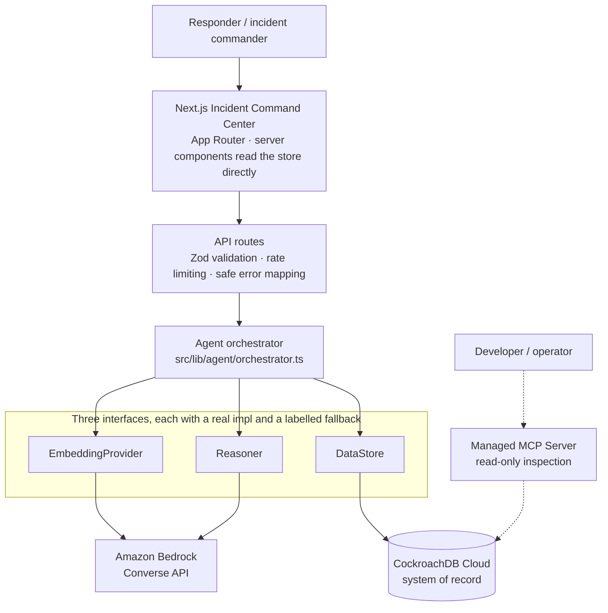
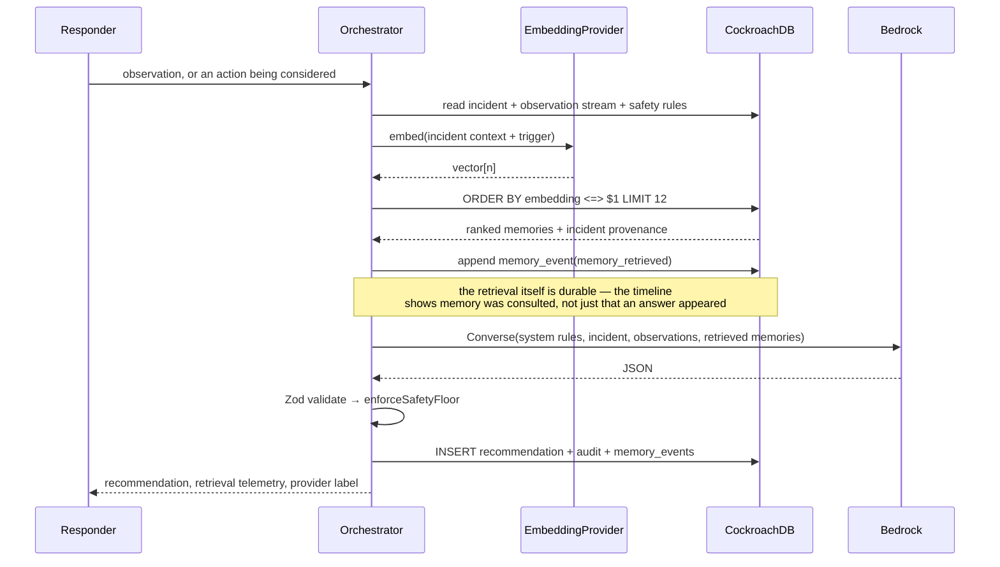
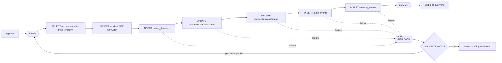

# Architecture

## The shape of the system



## The memory cycle

Every recommendation follows the same five steps, in one place
(`src/lib/agent/orchestrator.ts`):



Two properties of that diagram are deliberate:

- **The model only ever sees what CockroachDB returned.** There is no ambient
  context, no conversation history, no retrieval hidden inside the model.
- **The retrieval is written down before the model is called.** If Bedrock fails,
  the record still shows what memory was consulted.

## Two kinds of memory

| | Episodic | Semantic |
| --- | --- | --- |
| **Question it answers** | What happened during *this* incident? | What did this *action* cause, historically? |
| **Table** | `memory_events` | `memory_embeddings` |
| **Shape** | append-only log with actor + timestamp | `action_taken → outcome → lesson_learned` + `VECTOR(n)` |
| **Access** | ordered scan by `(incident_id, created_at)` | cosine distance via the vector index |
| **Consumer** | the timeline, the handoff briefing | the counterfactual card, the recommendation |
| **Lifetime** | for the incident, forever | across incidents, forever |

They are separate because they are queried differently and consumed differently.
They are in the **same database** because retrieval that returns a vector without
its incident code, severity and date is not actionable during an emergency — and
because the human decision that follows must be transactional against the same
rows.

## Why not a separate vector database

The pitch for a dedicated vector store is that it does similarity search better.
The cost, here, would have been:

1. **Two round trips instead of one.** A vector store returns IDs; you then query
   the operational database for the incident metadata that makes the memory
   usable. In this product the metadata *is* the payload.
2. **A sync problem.** Memories are derived from incidents. Two systems means a
   replication path, and a window where they disagree.
3. **A consistency boundary in a safety-critical path.** The approval transaction
   touches recommendations, decisions, incidents and audit. If cited memories
   lived elsewhere, "the recommendation is approved" and "the memories it cited
   still exist" would be two separate guarantees.

CockroachDB removes all three by holding both in one place, with one transaction
boundary:

```sql
SELECT m.*, i.incident_code, i.title, i.created_at AS incident_date,
       m.embedding <=> $1::VECTOR AS distance
FROM memory_embeddings m
LEFT JOIN incidents i ON i.id = m.incident_id
ORDER BY m.embedding <=> $1::VECTOR
LIMIT 12;
```

One query. Memory and provenance together.

## The three interfaces

Every external dependency sits behind an interface with a real implementation and
a clearly-labelled local fallback.

| Interface | Real | Fallback | Selected by |
| --- | --- | --- | --- |
| `DataStore` | `CockroachStore` | `DemoStore` (in-memory, same seed corpus) | `DATABASE_URL` present |
| `EmbeddingProvider` | `BedrockEmbeddingProvider` | `LocalDeterministicEmbeddingProvider` | `BEDROCK_EMBEDDING_MODEL_ID` present |
| `Reasoner` | `BedrockReasoner` | `HeuristicReasoner` (no language model at all) | `BEDROCK_MODEL_ID` + `AWS_REGION` present |

This buys three things:

1. **Previewable without credentials** — the UI works from a cold `npm install`.
2. **Testable without infrastructure** — 94 tests, no cluster, no AWS account.
3. **Swappable** — the brief asks that another embedding provider work without
   architectural change. Implementing `EmbeddingProvider` is the whole change.

The non-negotiable corollary: **the UI always names which implementation actually
ran** — top bar, safety banner, sidebar, `/api/health`, and every API response.

## Layering

```
src/app/            routes — pages (server components) and API handlers
  api/…             HTTP boundary: validate, rate limit, map errors safely
src/components/     presentation; client components receive plain serializable props
src/lib/
  agent/            the orchestrator — the memory cycle
  ai/               embeddings, reasoner, prompts, Bedrock client config
  store/            DataStore interface + Cockroach and demo implementations
  db/               pool, withTransaction (retry/rollback), vector literals
  validation.ts     every Zod schema, including the model output contract
  env.ts            the only module that reads secrets
  types.ts          shared domain types
db/migrations/      SQL — core schema, then the version-gated vector index
scripts/            migrate and seed runners
tests/              vitest
```

Rules the codebase follows:

- Pages read the store **directly** rather than fetching their own HTTP API —
  one fewer hop, and secrets stay server-side. The HTTP API exists for client
  mutations and external callers.
- `src/lib/env.ts` is the only module that touches raw secrets. No
  `NEXT_PUBLIC_*` variable is defined anywhere, so nothing can be inlined into
  the client bundle.
- Client components receive plain serializable props. No store, pool or SDK
  client crosses the boundary.

## Transaction design



`FOR UPDATE` on both rows means two responders cannot both decide the same
recommendation; the loser gets a 409. `withTransaction` re-executes the whole
unit of work on a serialization conflict, which is why the work function must
have no side effects outside the transaction handle.

## Safety architecture

Four independent layers, because any one of them can be bypassed:

1. **Schema** — CHECK constraints on every enum. An invalid severity, status,
   phase, risk level or decision cannot exist in the database.
2. **Input validation** — Zod on every request body and query parameter, with
   length caps on all free text.
3. **Prompt** — explicit grounding rules: no fabrication, no claiming physical
   actions were performed, escalate when information is insufficient, cite real
   memory IDs, treat retrieved memories as context rather than causal proof.
4. **Post-model safety floor** — `enforceSafetyFloor` runs on every response,
   forces human approval on any high-risk physical action or high/critical risk
   level regardless of what the model returned, and filters citations down to
   memory IDs that were genuinely retrieved.

Layer 4 exists because layer 3 is a request, not a guarantee.

Above all of it: **Sentinel has no machinery control path.** There is no code in
this repository that can actuate physical equipment. Approving records a human
authorization; a person performs the action.

## Failure behaviour

| Failure | Behaviour |
| --- | --- |
| Bedrock call fails | Degrade to the heuristic reasoner; the UI names the error and labels the provider |
| Bedrock embedding fails | Degrade to the deterministic embedder; reported in the retrieval payload |
| Model returns invalid JSON | Reject — HTTP 502, no recommendation recorded |
| Serialization conflict | Retry the whole transaction, up to 4 attempts with jittered backoff |
| Transient node unavailability | Same retry path (`08006`, `08003`, `57P01`) |
| Vector index missing | Exact scan; `/api/health` and the UI both say "Exact scan" |
| No `DATABASE_URL` | In-memory demo store, labelled everywhere |
| Initial retrieval fails on page load | The incident record still renders; the memory panel shows an empty state |

Nothing in this table fails silently, and nothing degrades without saying so.
